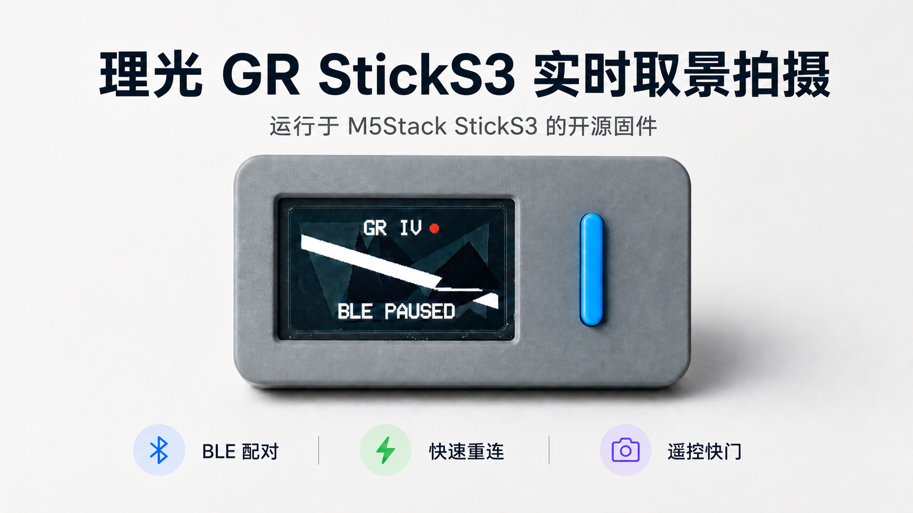

# RICOH GR IIIx Live View Shooting

在 **M5Stack StickS3** 上运行的 RICOH GR IIIx 蓝牙遥控器与实时取景器。StickS3 通过 BLE 与相机安全配对并读取 Wi-Fi 参数，再连接相机热点，在屏幕上显示 Live View；实时取景时短按蓝色按键即可自动对焦并拍照。

> 当前实机状态：**GR IIIx 首次配对、自动重连、Wi-Fi 实时取景和 BLE 快门均已验证可用。** GPS/BDS Unit v1.1 的读取与写入代码已经加入，但 StickS3 Port.C 引脚识别仍待实机修正，因此 GPS 功能目前属于实验功能。



## 功能

- RICOH GR IIIx BLE 扫描、六位验证码安全配对与绑定保存
- 已配对相机的自动重连
- 通过 BLE 读取 GR IIIx 动态 Wi-Fi 参数
- 在 StickS3 屏幕上显示相机 MJPEG 实时取景
- 蓝色按键触发自动对焦与拍摄
- StickS3 屏幕输入配对验证码
- 可选 Windows 快速验证码输入工具
- GPS/BDS Unit v1.1 定位数据写入 GR IIIx（实验性，尚未完整验证）

## 已验证硬件

- RICOH GR IIIx
- M5Stack StickS3（ESP32-S3）
- USB 数据线（烧录和首次配对时使用）
- 可选：M5Stack GPS/BDS Unit v1.1（AT6668）

本项目针对 **GR IIIx**。GR III、GR IV 及其他机型没有在此分支上验证，请勿假定协议完全相同。

## 准备开发环境

推荐在 Windows 上使用 [Visual Studio Code](https://code.visualstudio.com/) 和 PlatformIO 扩展。下列命令需要在 PlatformIO Core CLI 可用的终端中执行。

首次编译会下载 ESP32 平台与依赖库，需要能够访问对应的软件源。

## 编译与烧录

1. 用可传输数据的 USB 线连接 StickS3。
2. 打开 PowerShell，进入项目目录。
3. 编译固件：

```powershell
pio run -e m5stack-sticks3
```

4. 查明 StickS3 的串口号，然后烧录。下面以 `COM4` 为例：

```powershell
pio run -e m5stack-sticks3 --target upload --upload-port COM4
```

如果出现 `Write timeout` 或一直停在 `Connecting...`：

1. 关闭占用该串口的串口监视器或验证码工具。
2. 保持 USB 连接。
3. 长按 StickS3 侧面的复位/电源键，看到绿色指示灯闪烁后松开，让设备进入下载模式。
4. 重新执行烧录命令。

出现 `[SUCCESS]`、`Hash of data verified` 和 `Hard resetting via RTS pin` 表示烧录成功。

## 首次蓝牙配对

### 相机端

1. 打开 GR IIIx。
2. 确认蓝牙功能已启用。
3. 如果之前尝试过但失败，先在相机的“已配对设备”中删除 StickS3 对应记录。
4. 在相机中选择新增设备/执行配对。
5. 启动或复位 StickS3，等待其显示 `BLE SEARCHING` / `BLE CONNECTING`。

相机随后会显示六位验证码。这个验证码不会发送到短信或邮箱，必须输入给 StickS3。

### 方法 A：直接在 StickS3 上输入

进入 PIN 页面后：

- 短按蓝色按键：当前数字加 1（0 到 9 循环）
- 长按蓝色按键：确认当前数字并移动到下一位
- 六位全部确认后：自动提交验证码

### 方法 B：使用 Windows 快速输入工具

首次配对时间窗口较短，电脑工具通常更快。先安装 Python 3 和 `pyserial`：

```powershell
py -m pip install pyserial
py tools\pin_entry_gui.py COM4
```

将 `COM4` 换成 StickS3 的实际串口。工具打开后，相机一显示验证码就直接用电脑键盘输入六位数字；第六位输入后会自动发送。

> 验证码工具和 PlatformIO 串口监视器不能同时占用同一个 COM 端口。开始烧录前请关闭该工具。

配对成功后，相机的“已配对设备”中会新增一个设备，StickS3 会继续连接相机 Wi-Fi 并自动进入实时取景。以后通常无需再次输入验证码。

## 日常使用

1. 打开 GR IIIx，并保持在拍摄模式。
2. 打开 StickS3。
3. 等待 BLE 和 Wi-Fi 自动连接。
4. StickS3 出现实时取景画面后，**短按正面的蓝色按键**进行自动对焦并拍照。
5. 照片保存在相机的 SD 卡中，不会保存到 StickS3。

正常使用时 USB 线只负责供电或充电，**不需要连接相机**。StickS3 与相机之间使用 BLE 和 Wi-Fi 无线通信。

## 清除旧配对

如果设备长期停在 `BLE CONNECTING`，相机显示已经配对但无法进入实时取景，通常是两边保存的绑定密钥不一致：

1. 在 GR IIIx 的“已配对设备”中删除 StickS3 记录。
2. 在 StickS3 上长按第二功能键/KEY2 约 3 秒，清除本地 BLE 绑定缓存。
3. 重新执行首次配对。

## GPS/BDS Unit v1.1（实验功能）

GPS 模块计划通过 Grove 线连接 StickS3 的 Port.C，默认串口速率为 115200 bps。固件会在获得有效定位后，尝试每 10 秒向相机写入一次位置。

目前实机日志显示 Port.C 可能返回无效的 RX/TX 引脚，因此以下内容尚未确认：

- StickS3 与 GPS Unit v1.1 的实际 UART 引脚映射
- 稳定取得卫星定位
- GPS 信息成功写入照片 EXIF

不使用 GPS 时可以不连接模块，不影响 BLE、实时取景和拍照。

## 常见问题

### 相机已出现设备，但 StickS3 一直 `BLE CONNECTING`

删除相机端和 StickS3 端的旧绑定后重新配对。仅删除一端通常不够。

### 相机显示验证码后很快“处理失败”

先运行 Windows 验证码工具并确认它显示 COM 端口已连接，再让相机执行配对。看到六位数字后立即用键盘输入。

### 验证码工具显示 COM 端口未连接

- 在 Windows 设备管理器中确认实际串口号。
- 关闭 PlatformIO 串口监视器和其他占用串口的软件。
- 使用正确端口重新运行，例如 `py tools\pin_entry_gui.py COM5`。

### 绿色灯一直闪

配对或连接阶段闪烁通常表示程序仍在工作，并不等于烧录失败。以屏幕状态和串口日志为准。

### 已显示实时取景但不能拍照

确认相机仍处于拍摄模式，并短按而不是长按蓝色按键。拍摄结果请在相机 SD 卡中查看。

## 串口诊断

需要排查问题时，可在关闭验证码工具后打开串口监视器：

```powershell
pio device monitor --baud 115200 --port COM4
```

提交 Issue 时建议附上从 StickS3 上电开始的完整日志，但请打码 Wi-Fi 密码等私密信息。

## 项目结构

```text
src/                         StickS3 固件源码
src/ricoh_ble_client.*       GR IIIx BLE、配对、Wi-Fi 参数、快门和 GPS 协议
src/services/GpsService.*    GPS/BDS Unit v1.1 读取服务（实验性）
tools/pin_entry_gui.py       Windows 首次配对验证码工具
docs/gr3x_quickstart.md      精简测试步骤
platformio.ini               PlatformIO 构建配置
```

## 来源与致谢

本项目基于 [sky18Dragon/RICOH-GR-Live-View-Shooting](https://github.com/sky18Dragon/RICOH-GR-Live-View-Shooting) 修改，感谢原作者完成 StickS3 实时取景器的主体架构和 GR 相机控制实现。

此分支增加并调整了 GR IIIx 所需的 UUID 特征访问、安全配对流程、六位验证码输入、连接资源清理、Wi-Fi 参数读取以及实验性 GPS 支持。

## 许可证

本项目沿用原项目的 [GNU General Public License v3.0](LICENSE)。发布修改版或衍生版本时请遵守 GPL-3.0 的要求，并保留原项目的版权与许可证信息。
